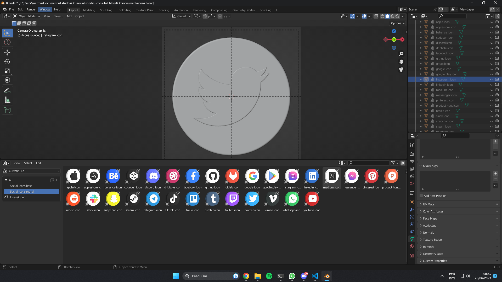

# Social Icons 3D

This project was created for learning purposes in 3D objects with React.

For this project, i used the following libraries 3D:
  - [Three.js](https://yarnpkg.com/package/three)
  - [@react-three/fiber](https://yarnpkg.com/package/@react-three/fiber)
  - [@react-three/drei](https://yarnpkg.com/package/@react-three/drei)

And for the 3D models, the .OBJ formats were rendered to .GLTF using Blender and the libraries: 
  - [gltf-pipeline](https://github.com/CesiumGS/gltf-pipeline)
    - Using the command: `gltf-pipeline -i <file.gltf> -o <newfile.gltf> -d`. To optimize the 3D file
  - [gltfjsx](https://github.com/pmndrs/gltfjsx)
    - Using the command: `npx gltfjsx <newfile.gltf> -t`. To create a React file using the resources of the react-three library. Note: -t will create a .tsx file with typings.

Some examples of icons in Blender::

